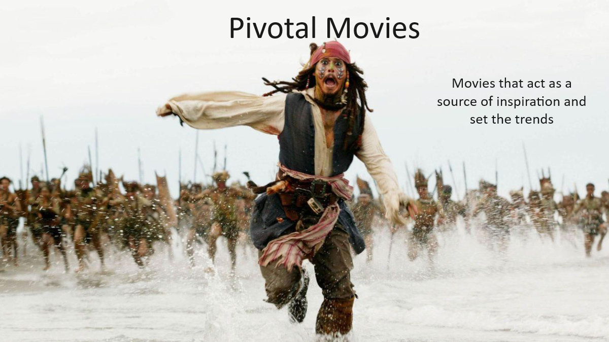

# Will the real pivotal movie please stand up? (change?)
Pivotal movies: Catch them if you can !
Pivotal movies: gotta catch’em all !

### catcher (image & phrase…)
Some movies are good, some movies are bad, some movies are pivotal.

## A Pivotal Movie - what’s that?

The history of cinema is shaped by innovation. Every now and then, a new filming technology is applied on a movie set, a never-seen-before mix of actor-types stands together on the screen, or a crazy new storyline is created, that inspires all following productions and changes the course of the industry as a whole. These changes are introduced by single movies, that stand out of the crowd and shape the future of the movie industry by creating a new hype around that specific new innovation. 

At least this is the assumption on which we base this data project: There are singular movies, that can be identified as being the source of a hype, that produced a concentrated release of movies similar to that singular one. These singular movies are called Pivotal Movies and have, supposedly, shaped the history of the movie industry. 

## The objective

In the course of this data story, we will show you our way to identify these Pivotal Movies. Based on several [datasets](the_data.md), which provide us with a series of metrics on a broad range of movies, a [identification-method](our_method.md) has been developed. With this, we are able to discover [the Pivotal Movies](the_results.md) throughout the history of cinema. 

[method evaluation](method_evaluation.md)

[conclusion](conclusion.md)