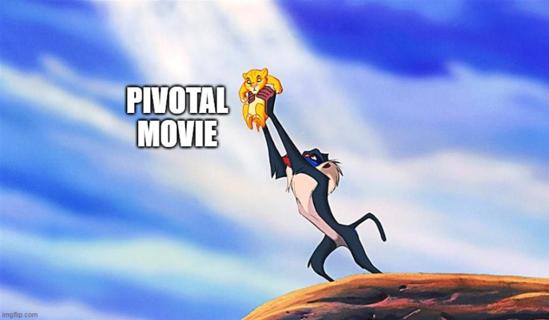

# The Results

Here are the movies, that have been identified as being the "most pivotal" by our algorithm (they have achieved the highest scores from the logistic regression model): 

|   name                          | id_wiki  | trend_genre                  | trend_id                              |
|---------------------------------|----------|------------------------------|---------------------------------------|
| The Man Called Flintstone       | 2031886  | Adventure, Crime Fiction    | Adventure, Crime Fiction of years 1966 |
| Bambi                           | 683122   | Adventure, Drama            | Adventure, Drama of years 1950        |
| 20,000 Leagues Under the Sea    | 5516824  | Adventure, Family Film      | Adventure, Family Film of years 1956  |
| The Bridge on the River Kwai    | 42856    | Adventure, War film         | Adventure, War film of years 1958     |
| LongHaired Hare                 | 3150514  | Animation, Short Film       | Animation, Short Film of years 1949  |
| Charade                         | 899442   | Black comedy                | Black comedy of years 1964            |
| Casper                          | 21132353 | Black comedy, Comedy-drama  | Black comedy, Comedy-drama of years 1994 |
| Ghostbusters                    | 205013   | Comedy, Fantasy             | Comedy, Fantasy of years 1983         |

some comments on them (validation by source, why it's correect or not)

Our algorithm is not the perfect method for identifying Pivotal Movies, as sometimes it cooks strange results. Here are a few examples: 

- show some bad results and comment on them (why etc.)

So, at this point we get it: the results need to be interpreted. We built a machine that gives a result for whatever we feed it. Some results come up as obvious: it makes sense that The Godfather of Francis Ford Coppola, released in 1972, is the pivotal movie of the Crime Fiction trend that peaked in 1977. It is often cited as a landmark of the genre.
On the other hand, some results need to be elaborated or questioned.
Take for example The Silence of the Lambs by Jonathan Demme, released in 1991, and detected as the pivotal movie of the LGBT trend that peaked in 1993. If you don’t know the movie, here is a quick synopsis: “A psychopath known as Buffalo Bill wreaks havoc on the Middle West by kidnapping and murdering young women. Clarice Starling, a young FBI agent, is assigned to interrogate ex-psychiatrist Hannibal Lecter. A fearsomely intelligent psychopath with a penchant for cannibalism, Lecter is able to provide her with information. A bond of fascination and repulsion develops between them.”. Multiple interpretations are possible, but we can provide you with ours:
- First impression: it’s misclassified ! this movie is not about LGBT thematic, actually some genres are too easily attributed, even if it isn’t the main topic of the movie, and if one main character got LGBT attributes, the whole movie will be labelled as LGBT.
- After some reflection: actually not so many movies have been using LGBT main characters in their storylines in the past, so the fact that such a big success as Silence of the Lambs does might have put LGBT into the spotlight.
- More advanced thoughts: after some research, Silence of the Lambs has been criticised for repeating LGBT stereotypes, and [“impacted transgender people for the worse”](https://www.vox.com/culture/22281548/silence-of-the-lambs-cultural-impact-legacy-feminist-transphobia). However, LGBT is more than a simple “cinema genre”. Before that, it is a society phenomenon, so analysing it as a cinema genre is pretty difficult and might not give quality conclusions.
- Final point: even if Silence of the Lambs had a bad impact on the LGBT community, the result we have by finding it as a pivotal reflect that a society phenomenon started to rise around these years for the LGBT question.
Such analyses are fascinating and make us realise that the movie industry and the real world are indeed intimately connected.

## Find the Pivotal Movies of your favourite genre

In this graph you can choose the genre you're interested in, and our algorithm will calculate the Pivotal Movies within this genre: 

(interactive graph with all subsets to choose from)
